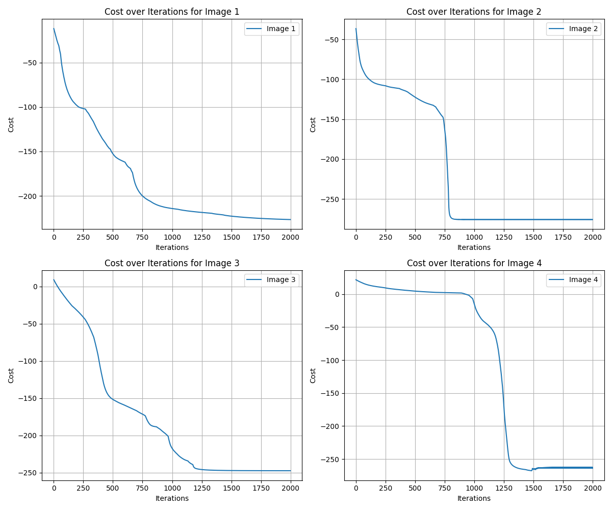
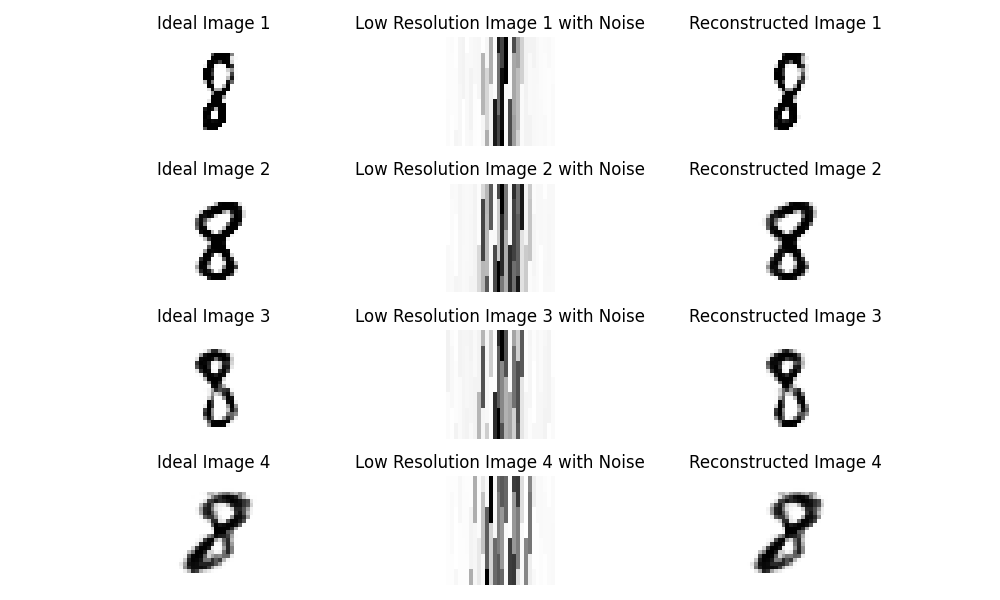

# Image Reconstruction from Noisy Low-Resolution Data

## Overview

In this problem, we reconstruct high-resolution images from noisy, low-resolution measurements. Given the data2.mat file, we process the **Xn** matrix (49×4) to approximate the ideal images **Xi** (784×4) using a generative model and gradient descent.

## Data Description
- **Xi** (784×4): Four ideal digit '8' images in vector form (28×28). These are used only for validation.
- **Xn** (49×4): Low-resolution and noisy versions of Xi, obtained by:
    - Reducing resolution (dividing 28×28 into 7×7 by averaging 4×4 pixel blocks).
    - Adding Gaussian noise with unknown variance.

## Methodology

1. **Transformation Matrix (T)**: The degradation process is modeled as a linear transformation **Xn = T Xi + noise**, where **T (49×784)** maps high-resolution images to low-resolution ones.

2. **Neural Network-Based Reconstruction:**
    - A pre-trained generative model is used to approximate the high-resolution input Xi.
    - Gradient Descent optimizes a latent variable Z to minimize reconstruction error.

3. **Upscaling for Visualization: Low-resolution (7×7) images are resized to 28×28 by repeating each pixel in a 4×4 grid.**

## Results
- The reconstructed images closely match the ideal versions, demonstrating the model’s ability to remove noise and restore missing details.
- The cost function plot shows how gradient descent improves reconstruction quality over iterations.

### Example Output

#### Cost Function vs. Iteration

  

#### Reconstructed Images

  

- **Left**: Ideal image (**Xi**)
- **Middle**: Noisy low-resolution input (**Xn**)
- **Right**: Reconstructed image